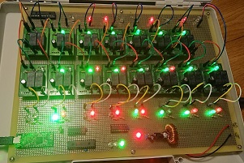

# Summer2019CalculatorProject
Summer Vacation 2019 Project with my daughter to create a relay based 8bit ALU. This is the GUI part.

For the science class project, my 11-year daughter made an 8 bits integer adder using
electro-magnetic relays as a logic device.

This python code is the GUI and communication interface to feed two 8-bit inputs
and display the 9-bit (8 bits with carry) result on a host computer.

* The host talks to the target hardware (the adder) via USB.
* FTDI's FT232H device is on the target hardware serves as a remote controlled
  GPIO device which talks to two shift registers (MPC23S17) to feed A and B inputs and
  retrieve the computed sum.

